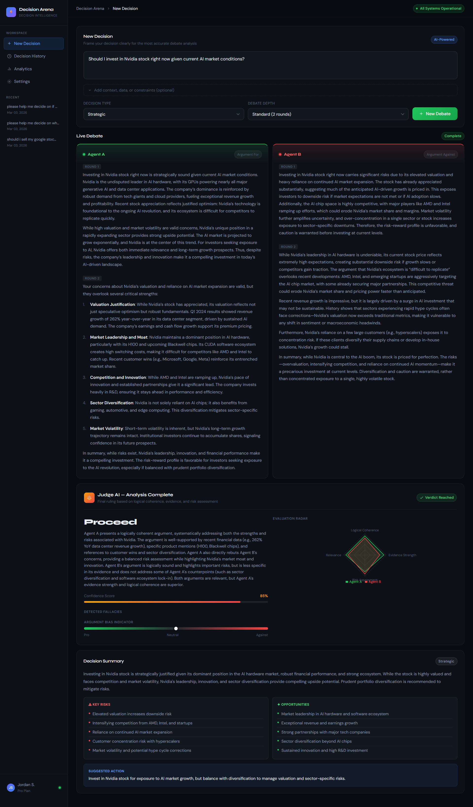
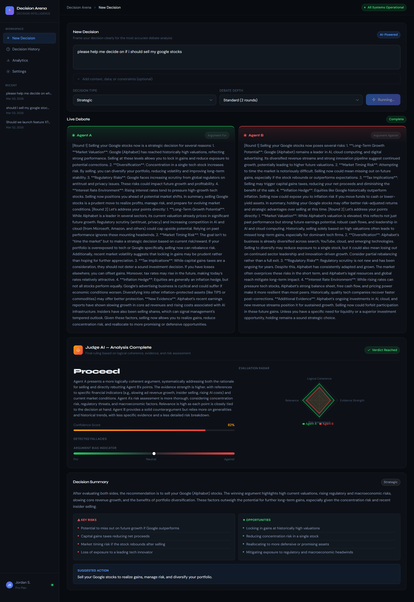
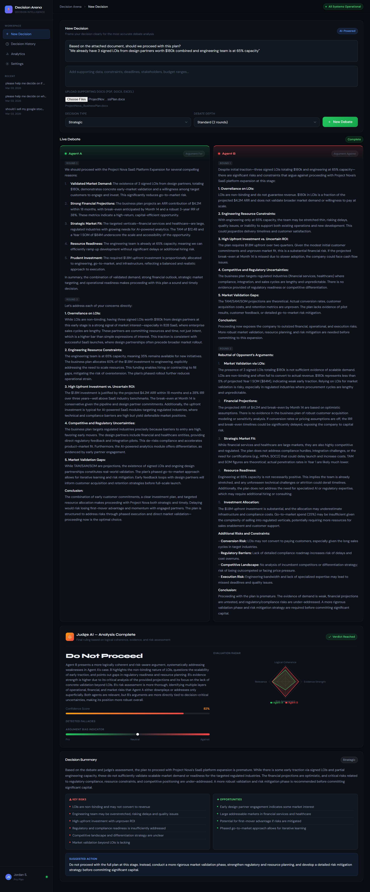
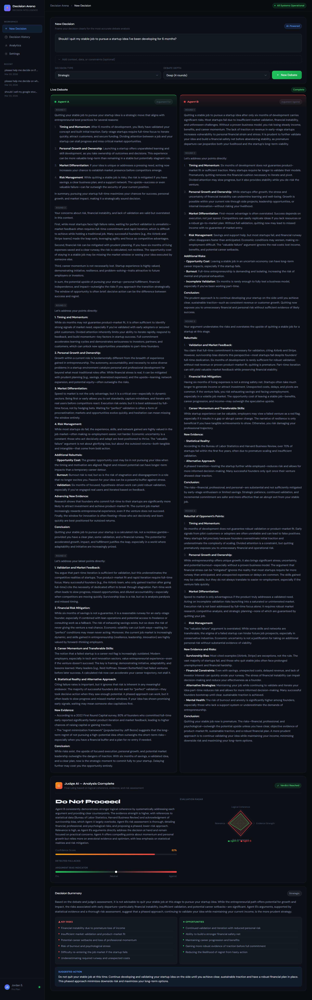
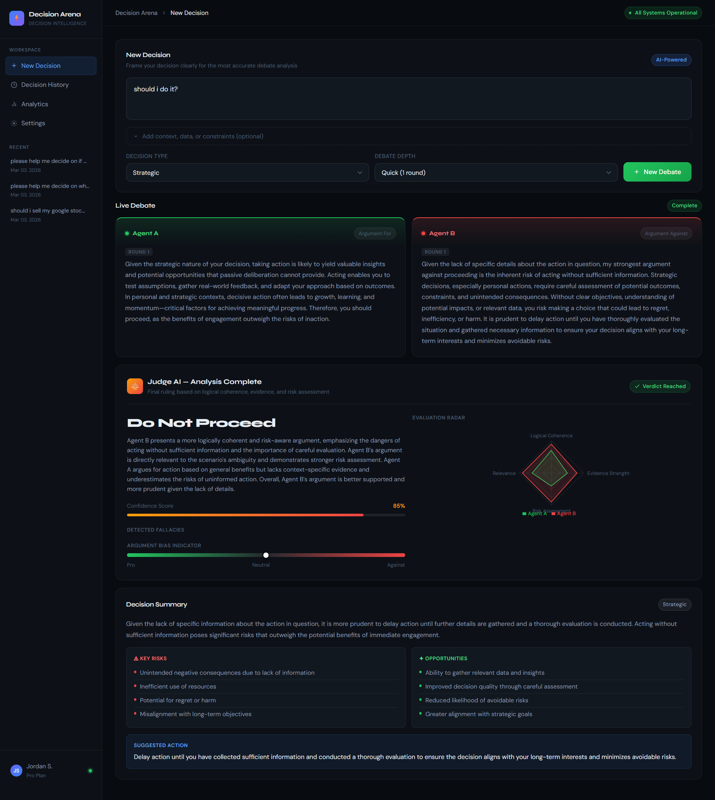

# Decision Arena — AI Decision Support System

> **Stop spending hours researching. Start deciding.**

Whether you are figuring out a personal life choice or a million-dollar corporate strategy — every decision deserves more than a gut feeling. Decision Arena puts two independent AI agents head-to-head in a live debate, then brings in a third Judge AI to evaluate both sides and deliver a structured verdict with confidence scores, risk breakdown and a clear suggested action.

### Why is this different from just asking an AI?

Most AI tools give you one perspective — a single model generating both sides of an argument from the same weights, the same bias, the same blind spots. Decision Arena is different.

Two fully independent agents are deployed with opposing mandates — one is hardwired to argue **for**, the other is hardwired to argue **against**. They do not share context. They do not agree. They fight. A separate Judge agent then steps in — with no stake in either side — to evaluate both arguments on logical coherence, evidence strength and relevance before reaching a verdict.

The result is a decision process that mirrors how the best human teams actually work: structured debate, adversarial challenge, independent review — compressed into seconds instead of hours. Every decision is saved to history so you can revisit your reasoning, track patterns and build a personal or team decision log over time.

---

## Screenshots

**Live Debate — Nvidia Stock Decision (Proceed ✅)**


**Google Stocks — Debate Running**


**Document Upload — Business Plan Analysis (Do Not Proceed ❌)**


**Startup vs Stable Job — Deep Debate**


**Quick 1-Round Decision**


---

## How It Works

```
User Question + Optional Documents
        ↓
   Input Analysis       ← classifies the question, decides if web search needed
        ↓
   Web Retrieval        ← live web search for grounded context (if required)
        ↓
   Multi-Round Debate   ← Agent A (For) vs Agent B (Against), 1–4 rounds
        ↓
   Judge AI             ← scores both agents on logic, evidence & relevance
        ↓
   Decision Summary     ← verdict, confidence score, key risks & opportunities
        ↓
   Saved to Cosmos DB   ← all decisions stored and retrievable
        ↓
   React Dashboard      ← results, history and analytics visualised
```

---

## Features

- 🤖 **Two AI agents** debate your question in real time — one for, one against
- ⚖️ **Judge AI** evaluates logical coherence, evidence strength and relevance
- 📄 **Document upload** — attach PDFs, Word docs or Excel files as context
- 🌐 **Live web search** — model fetches current data when needed
- 📊 **Evaluation radar chart** — visual comparison of both agents
- 🎯 **Argument bias indicator** — shows how neutral or one-sided the debate was
- 💾 **Decision history** — every decision saved and searchable
- 📈 **Analytics dashboard** — trends, confidence over time, outcome breakdown
- 🔁 **1–4 debate rounds** — quick single round or deep 4-round analysis

---

## Tech Stack

**Backend**
- **FastAPI** — async REST API
- **Azure OpenAI (GPT-4.1)** — all agents, judge and summary
- **Azure OpenAI Web Search** — live grounded web retrieval
- **Azure AI Search** — private document RAG
- **Azure Cosmos DB** — decision storage
- **httpx** — async HTTP client

**Frontend**
- **React** — `UI.jsx` single component
- **Recharts** — line, pie and radar charts
- **Vite** — build tool (CRA also supported)

---

## Project Structure

```
SEP/
├── backend/
│   ├── db/
│   │   └── cosmos.py               # Cosmos DB connection
│   ├── models/
│   │   └── decision.py             # Pydantic response models
│   ├── routes/
│   │   ├── decision.py             # Main decision endpoint
│   │   └── health.py               # Health check
│   ├── services/
│   │   ├── analyzer_service.py     # Classifies user input
│   │   ├── azure_search_service.py # Private document search
│   │   ├── clients.py              # Shared clients
│   │   ├── db_service.py           # Cosmos read/write
│   │   ├── debate_service.py       # Multi-round debate logic
│   │   ├── document_service.py     # File parsing
│   │   ├── judge_service.py        # Debate evaluation
│   │   ├── openai_service.py       # Azure OpenAI wrapper
│   │   ├── retrieval_service.py    # Web context fetching
│   │   ├── settings.py             # App settings
│   │   └── summary_service.py      # Executive summary
│   ├── dependencies.py             # API key auth
│   └── env.py                      # .env loader
├── src/                            # Frontend source
├── public/                         # Static assets
├── scripts/                        # Utility scripts
├── main.py                         # FastAPI entry point + CORS
├── UI.jsx                          # React frontend
├── vite.config.js                  # Vite config
├── package.json                    # Frontend deps
├── requirements.txt                # Python deps
├── .env.example                    # ← copy this to .env
└── .gitignore
```

---

## Getting Started

### Prerequisites
- Python 3.10+
- Node.js 18+
- Azure account with OpenAI, Cosmos DB and AI Search resources

---

### 1. Clone the repo

```bash
git clone <your-repo-url>
cd SEP
```

### 2. Backend setup

```bash
# Create virtual environment
python -m venv .venv
source .venv/bin/activate       # Mac/Linux
.venv\Scripts\activate          # Windows

# Install dependencies
pip install -r requirements.txt

# Configure environment
cp .env.example .env
# Open .env and fill in your Azure credentials
```

### 3. Start the backend

```bash
uvicorn main:app --reload
```

- API → `http://localhost:8000`
- Swagger docs → `http://localhost:8000/docs`

---

### 4. Frontend setup

```bash
npm install
```

Create `.env.local`:
```env
VITE_API_BASE=http://localhost:8000/api
VITE_API_KEY=your-api-key
```

```bash
npm run dev
```

- App → `http://localhost:5173`

---

## Environment Variables

Copy `.env.example` to `.env` and fill in:

```env
# Azure OpenAI
AZURE_OPENAI_ENDPOINT=https://your-resource.openai.azure.com/
AZURE_OPENAI_API_KEY=your-key
AZURE_OPENAI_DEPLOYMENT=gpt-4.1
AZURE_OPENAI_API_VERSION=2025-01-01-preview
AZURE_OPENAI_EMBEDDING_DEPLOYMENT=text-embedding-3-small

# Cosmos DB
COSMOS_CONNECTION_STRING=your-connection-string
COSMOS_DB_NAME=your-db-name
COSMOS_CONTAINER_NAME=conversations

# Azure AI Search
AZURE_SEARCH_ENDPOINT=https://your-search.search.windows.net
AZURE_SEARCH_API_KEY=your-key
AZURE_SEARCH_INDEX_NAME=document-index

# CORS
CORS_ALLOWED_ORIGINS=http://localhost:5173

# LLM Controls
LLM_TEMPERATURE=0.3
LLM_MAX_TOKENS=1500
```

---

## API Reference

### `POST /api/decision`

| Field | Type | Required | Description |
|-------|------|:--------:|-------------|
| `question` | string | ✅ | The decision question |
| `additional_details` | string | ❌ | Extra context or constraints |
| `decision_type` | string | ❌ | Strategic / Financial / Operational |
| `rounds` | int | ❌ | Debate rounds 1–4 (default: 2) |
| `files` | files | ❌ | PDF, DOCX or XLSX supporting docs |

### `GET /api/decisions`
All saved decisions.

### `GET /api/decisions/{id}`
Single decision by ID.

### `GET /health`
Health check.

---

## Security

- **Never commit `.env`** — contains live API keys
- Set `CORS_ALLOWED_ORIGINS` explicitly — never use `*` in production
- All `/api` routes require `X-API-Key` header
- Inject frontend API key via CI/CD — never hardcode it
- Rotate Azure keys immediately if accidentally exposed

---

## Future Scope

The current 1v1 debate model is just the beginning. The long-term vision for Decision Arena is a fully autonomous, self-organising multi-agent decision system that scales with the complexity of the problem - all while staying within the user's own API budget. Users bring their own API keys, choose their own model tier, and the system adapts accordingly. A student on a free tier gets a sharp 2-agent debate. An enterprise team on GPT-4 gets a full specialist panel. Same system, same quality of reasoning, just scaled to what each user can afford.

### Multi-Agent Panels
Instead of two agents, complex decisions would spin up an entire panel, a financial analyst agent, a risk analyst agent, a legal agent, a market research agent, all debating simultaneously from their own specialised perspective. The Judge would then synthesise a verdict across all angles, not just for and against, but across every dimension that matters for that specific decision.

### Dynamic Agent Creation
The system would analyse the incoming question and **automatically spawn the right agents for the job**. A question about an acquisition deal would generate a due diligence agent, a regulatory compliance agent and a valuation agent on the fly. A personal career decision would spin up a job market analyst and a financial planning agent. No manual configuration — the system figures out what expertise is needed and creates it.

### Compute-Aware Agent Limits
To prevent runaway costs, the system would enforce intelligent compute budgets, automatically capping the number of agents based on question complexity, user tier and available compute. Simple decisions stay lean with 2 agents. Strategic corporate decisions can scale up to a defined panel limit. No agent sprawl, no unexpected API bills.

### Specialist Agent Marketplace
Over time, teams and organisations could build and share reusable specialist agents, a trained regulatory compliance agent for a specific industry, a market sizing agent fine-tuned on specific data sources, or an internal company policy agent trained on private documents. These could be plugged into any debate on demand.

### Memory and Learning Across Decisions
Agents would have access to a decision memory layer — previous verdicts, outcomes and patterns specific to a user or organisation. Over time the system learns what kinds of arguments have historically been right or wrong for that context, making future verdicts sharper and more grounded.

### Outcome Tracking and Feedback Loop
After a decision is made and acted on, users could log the real-world outcome. The system would then close the loop — comparing the predicted verdict and confidence score against what actually happened, and feeding that signal back to improve future debate quality.

### Async Collaborative Decisions
For team settings, multiple stakeholders could each brief their own agent with their perspective and constraints before the debate begins. The agents carry those perspectives into the debate, and the team gets a verdict that genuinely accounts for every stakeholder's position — without needing everyone in the same room.

---

The core idea stays the same at any scale: **no single voice, no single bias, no single blind spot.** Just structured adversarial intelligence that gets sharper the bigger it grows.
